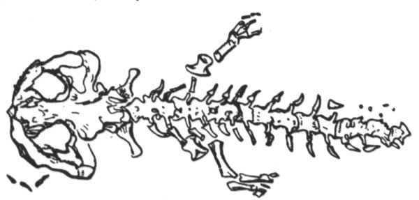

<section>

Bez konce je lidská všetečnost. Lidem nestačilo, že profesor J. W. Hopkins (Yale Un.), největší té doby autorita v oboru reptilií[^13], prohlásil ony záhadné tvory za nevědecký humbuk a pouhou fantazii; v odborném tisku i v novinách se počaly množit zprávy o výskytu dosud neznámých zvířat, podobných obrovským mlokům, na nejrůznějších místech Tichého oceánu. Poměrně spolehlivé údaje uváděly naleziště na ostrovech Šalomounských, na ostrově Schoutenově, na Kapingamarangi, Butaritari a Tapeteuea, dále na celé skupině ostrůvků: Nukufetau, Fanufuti, Nukonono a Fukaofu, potom až na Hiau, Uahuka, Uapu a Pukapuka. Byly citovány pověsti o čertech kapitána van Tocha (hlavně v oblasti melanéské) a o tritonech slečny Lily (spíše v Polynésii); i usoudily noviny, že jde asi o různé druhy podmořských a předpotopních oblud, zvláště proto, že nastala letní sezona a nebylo o čem psát. Podmořské obludy mívají u čtenářů značný úspěch. Zejména v USA přišli tritoni do módy; v New Yorku se hrála třistakrát výpravná revue Poseidon s třemi sty nejkrásnějšími tritonkami, nereidkami[^14] a sirénami; v Miami i na plážích kalifornských se mládež koupala v kostýmech tritonů a nereidek (tj. tři šňůry perel a nic víc), kdežto ve středních a středozápadních státech neobyčejně zmohutnělo Hnutí pro Potírání Nemravnosti (HPN); přitom došlo k veřejným projevům a několik černochů bylo dílem pověšeno, dílem upáleno.

Konečně vyšel v The National Geographic Magazine bulletin Vědecké Výpravy Kolumbijské univerzity (pořádané nákladem J. S. Tinckera, takřečeného Krále Konzerv); tu zprávu podepsali P. L. Smith, W. Kleinschmidt, Charles Kovar, Louis Forgeron a D. Herrero, tedy kapacity světové pověsti zejména v oboru rybích parazitů, červů kroužkovaných, rostlinné biologie, nálevníků a mšic. Z obsáhlé zprávy vyjímáme:

_… Na ostrově Rakahanga se výprava poprvé setkala s otisky zadních noh dosud neznámého obrovského mloka. Otisky jsou pětiprsté, délka prstů 3 až 4 cm. Podle počtu šlépějí se musí pobřeží ostrova Rakahanga těmito mloky přímo hemžit. Protože tu nebylo otisků předních noh (až na jeden čtyřprstý otisk, patrně mláděte), usoudila výprava, že tito mloci se patrně pohybují po zadních končetinách._

_Podotýkáme, že na ostrůvku Rakahanga není řeka ani močál; tito mloci žijí tedy v moři a jsou asi jedinými zástupci svého řádu, kteří obývají prostředí pelagické[^15]. Je ovšem známo, že mexický axolotl (Amblystoma mexicanum) se zdržuje ve slaných jezerech; ale o mlocích pelagických (v moři žijících) nenalézáme zmínky ani v klasickém díle W. Korngolda Obojživelníci ocasatí (Urodela), Berlín 1913._

_… Čekali jsme až do odpoledne, abychom ulovili nebo aspoň spatřili živý exemplář, ale marně. S lítostí jsme opouštěli půvabný ostrůvek Rakahanga, kde se D. Herrerovi podařilo nalézt krásný nový druh ploštice…_

_Daleko větší štěstí nám přálo na ostrově Tongarewa. Čekali jsme na pobřeží s puškami v rukou. Po západu slunce se vynořily z vody hlavy mloků, poměrně veliké a mírně zploštělé. Po chvíli vlezli mloci na písek, kráčejíce kolébavě, ale dosti mrštně po zadních nohách. Vsedě byli vysocí něco přes metr. Rozsadili se v širokém kruhu a počali zvláštním pohybem kroužit hoření polovinou těla; vypadalo to, jako by tančili. W. Kleinschmidt povstal, aby lépe viděl. Tu mloci k němu obrátili hlavy a na krátký okamžik úplně strnuli; potom se k němu počali se značnou rychlostí blížit, vydávajíce sykavé a štěkavé zvuky. Když byli od něho asi na sedm kroků, střelili jsme do nich z pušek. Dali se velmi rychle na útěk a vrhli se do moře; toho večera se už neukázali. Na břehu zůstali jenom dva mloci mrtví a jeden s přeraženou páteří, který vydával zvláštní zvuk, jako „ogod, ogod, ogod“. Později skonal, když W. Kleinschmidt otevřel nožem jeho dutinu plicní… (Následují anatomické podrobnosti, kterým bychom my laikové stejně nerozuměli; i odkazujeme odborné čtenáře na citovaný bulletin.)_

_Jde tedy, jak z uvedených znaků zřejmo, o typického člena řádu obojživelníků ocasatých (Urodela), k nimž, jak je každému známo, náleží čeleď mloků pravých (Salamandrida), zahrnující rod čolků (Tritones) a mloků (Salamandrae), a čeleď mloků pulcovitých (Ichthyoidea), zahrnující mloky krytožábré (Cryptobranchiata) a žabernaté (Phanerobranchiata). Mlok zjištěný na ostrově Tongarewa zdá se být nejblíže příbuzný mlokům pulcovitým krytožábrým; v mnohém směru, mimo jiné svou velikostí, připomíná japonského velemloka obrovského (Megalobatrachus Sieboldii) nebo amerického hellbendra, zvaného „bahenní čert“, ale liší se od nich dobře vyvinutými čidly a delšími, silnějšími končetinami, které mu dovolují pohybovat se dosti obratně ve vodě i na souši. (Následují další podrobnosti srovnávací anatomie.)_

 

Andrias Scheuchzeri

_Když jsme vypreparovali kostry zabitých zvířat, došli jsme nejzajímavějšího poznatku: že totiž kostra těchto mloků se shoduje téměř dokonale s fosilním otiskem mločí kostry, jejž nalezl na kamenné desce z öhningenských lomů dr. Johannes Jakob Scheuchzer a vyobrazil ve spise „Homo diluvii testis“, vydaném roku 1726. Méně znalým čtenářům budiž připomenuto, že řečený dr. Scheuchzer považoval tuto fosilii za pozůstatky předpotopního člověka. „Přiložený tuto obraz,“ píše, „jejž předkládám učenému světu v pěkném dřevorytu, jest zajisté beze vší pochyby obrazem člověka, jenž byl svědkem potopy světa; není tu linií, z nichž by si bujná obraznost musela teprve sestrojiti něco, co by bylo podobno člověku, nýbrž všude úplná shoda s jednotlivými díly kostry lidské a dokonalá souměrnost. Člověk zkamenělý zobrazen tu zpředu; ejhle pomník vyhynulého lidstva, starší všech náhrobků římských, řeckých, ba i egyptských a všech východních vůbec.“ Později Cuvier rozpoznal v öhningenském otisku kostru zkamenělého mloka, který byl nazván Cryptobranchus primaevus nebo Andrias Scheuchzeri Tschudi a považován za species dávno vymřelou. Osteologickým srovnáním se nám podařilo identifikovat naše mloky s domněle vyhynulým pramlokem Andriasem. Tajemný praještěr, jak se mu říkalo v novinách, není nic jiného než fosilní krytožábrý mlok Andrias Scheuchzeri; nebo je-li třeba nového jména, Cryptobranchus Tinckeri erectus čili velemlok polynéský._

_… Záhadou zůstává, proč tento zajímavý velemlok unikl až dotud vědecké pozornosti, ačkoliv se aspoň na ostrovech Rakahanga a Tongarewa v souostroví Manihiki vyskytuje hromadně. Ani Randolph a Montgomery ve svém spise „Dva roky na ostrovech Manihiki“ (1885) se o něm nezmiňují. Místní obyvatelé tvrdí, že se toto zvíře – které ostatně považují za jedovaté – začalo ukazovat teprve před šesti nebo osmi léty. Vypravují, že „mořští čerti“ dovedou mluvit (!) a staví si v zálivech, kde žijí, celé soustavy valů a hrází na způsob podmořských měst; prý v jejich zálivech je po celý rok voda tichá jako v rybníce; prý si vyhrabávají pod vodou mnoho metrů dlouhé nory a chodby, ve kterých se zdržují během dne; prý v noci kradou na polích sladké brambory a yamy a odnášejí lidem motyky a jiné nářadí. Vůbec lidé je mají neradi, a dokonce se jich obávají; v mnoha případech se odstěhovali raději na jiná místa. Zřejmě tu jde o pouhé primitivní pověsti a pověry, zdůvodněné leda odpuzujícím vzhledem a vzpřímenou, poněkud lidskou chůzí neškodných velikých mloků._

_… Se značnou opatrností je nutno přijímat také zprávy cestovatelů, podle nichž se tito mloci objevují také na jiných ostrovech než na Manihiki. Zato lze bez nejmenší pochybnosti určit recentní vtisk zadní nohy, nalezený na břehu ostrova Tongatabu, jejž publikoval Capt. Croisset v La Nature, jako šlépěj Andriase Scheuchzeri. Tento nález je zvláště důležitý tím, že spojuje výskyt na Manihiki Islands s oblastí australsko-novozélandskou, kde se uchovalo tolik zbytků vývoje prastaré fauny; připomeňme si zejména „předpotopního“ ještěra haterii čili tuataru, dodnes žijícího na ostrově Stephenově. Na těchto osamělých, většinou málo osídlených a civilizací téměř nedotčených ostrůvkách se mohly ojediněle uchovat zbytky živočišných typů jinde již vymřelých. K fosilnímu ještěru haterii přibývá nyní dík panu J. S. Tinckerovi předpotopní mlok. Dobrý dr. Johannes Jakob Scheuchzer by se nyní dožil vzkříšení svého öhningenského Adama…_

Tento učený bulletin by zajisté stačil, aby vědecky plně osvětlil otázku záhadných mořských netvorů, o které už bylo tolik řečí. Naneštěstí současně s ním vyšla zpráva holandského badatele van Hogenhoucka, který zařadil tyto krytožábré velemloky do čeledi mloků pravých neboli tritonů pod jménem Megatriton moluccanus a určil jejich rozšíření na holandsko-sundských ostrovech Džilolo, Morotai a Ceram; dále zpráva francouzského učence dr. Mignarda, který je určil jako typické salamandry, vykázal jim původní sídla na francouzských ostrovech Takaroa, Rangiroa a Raroia a nazval je zcela prostě Cryptobranchus salamandroides; dále zpráva H. W. Spence, který v nich rozpoznal novou čeleď Pelagidae, domorodou na ostrovech Gilbertových a schopnou nabýt odborné jsoucnosti pod druhovým jménem Pelagotriton Spencei. Mr Spenceovi se podařilo dopravit jeden živý exemplář až do londýnského zoo; zde se stal předmětem dalšího bádání, z něhož vyšel pod názvy Pelagobatrachus Hookeri, Salamandrops maritimus, Abranchus giganteus, Amphiuma gigas a mnohými jinými. Někteří učenci tvrdili, že Pelagotriton Spencei je totožný s Cryptobranchus Tinckeri a že Mignardův salamandr není nic jiného než Andrias Scheuchzeri; bylo z toho mnoho sporů o prioritu a o jiné čistě vědecké otázky. Tím se stalo, že nakonec přírodověda každého národa měla své vlastní velemloky a vědecky co nejzuřivěji potírala velemloky národů jiných. Proto také až do konce nebylo po vědecké stránce zjednáno v té celé veliké záležitosti s mloky dostatečně jasno.

</section>

[^1]: Dubbeltje – drobná holandská mince. _Pozn. red_.

[^2]: Kampong – malajská vesnice s tržištěm. _Pozn. red_.

[^3]: Toddy – palmové víno. _Pozn. red_.

[^4]: Bedřich Golombek (1901–1961), čes. novinář a prozaik. _Pozn. red_.

[^5]: Edvard Valenta (1901–1978), čes. spisovatel a publicista. _Pozn. red_.

[^6]: Jan Eskymo Welzl (1848–1948), čes. cestovatel, vynálezce a dobrodruh. _Pozn. red_.

[^7]: Lambrekýny (hol.) – závěsy na okna a dveře. _Pozn. red_.

[^8]: Pozamentérie – pásková textilie určená k dekoraci. _Pozn. red_.

[^9]: Bezoár – usazenina v útrobách některých savců považovaná za léčivý prostředek. _Pozn. red_.

[^10]: YMCA – Young Men´s Christian Association, Křesťanské sdružení mladých mužů. _Pozn. red_.

[^11]: Schillerův rytíř – odkaz na baladu _Rukavička_ Friedricha Schillera. _Pozn. red_.

[^12]: Trader Horn – ve své době populární americký film o obchodníkovi Hornovi a jeho cestě do Afriky. _Pozn. red_.

[^13]: Reptilia (lat.) – plazi. _Pozn. red_.

[^14]: Nereidky – mořské víly. _Pozn. red_.

[^15]: Pelagiál – vody osídlené planktonem. _Pozn. red_.

[^16]: „Zázrační“ koně z chovu něm. podnikatele Kralle, kteří údajně uměli počítat a výsledky oznamovali údery kopyt. _Pozn. red_.

[^17]: Mae West – amer. herečka, sex-symbol 30. let. 20. stol. _Pozn. red_.

[^18]: V praxi, v akci. _Pozn. red_.

[^19]: Lemurie – bájný světadíl (podobně jako Atlantida), měl se rozkládat v Indickém oceánu. _Pozn. red_.

[^20]: Zábava, rozptýlení. _Pozn. red_.

[^21]: Využití, zneužití. _Pozn. red_.

[^22]: Pojištění. _Pozn. red_.

[^23]: Živočich pracující, vyrábějící. _Pozn. red_.

[^24]: Mlok a německý národ. _Pozn. red_.

[^25]: Vývoj obojživelníků za fašismu. _Pozn. red_.

[^26]: Trade Unie – zaměstnanecké odbory. _Pozn. red_.

[^27]: Barkasa – člun sloužící zejména pro dopravu mezi kotvící lodí a břehem. _Pozn. red_.

[^28]: Je to podivín. _Pozn. red_.

[^29]: Zpráva o tělesných schopnostech Mloků. _Pozn. red_.

[^30]: Xeróza (řec.) – chorobná suchost. _Pozn. red_.

[^31]: François Coppé (1842–1908), franc. básník. _Pozn. red_.

[^32]: Basic English – jazyk se zásobou 850 slov, který byl vytvořen v roce 1929. _Pozn. red_.

[^33]: Ušlechtilý jazyk latinský. _Pozn. red_.

[^34]: Svět pozemský. _Pozn. red_.

[^35]: Měnový systém založený na dvou drahých kovech, na zlatě a stříbře. _Pozn. red_.

[^36]: Právě tím. _Pozn. red_.

[^37]: Podivuhodná díla boží. _Pozn. red_.

[^38]: Monismus (řec.) – filozofická koncepce, podle níž je základem všeho jediná podstata. _Pozn. red_.

[^39]: Mloci, pryč se Židy! _Pozn. red_.

[^40]: Hej, vy, … co tady hledáte? _Pozn. red_.

[^41]: Starosta a poslanec. _Pozn. red_.

[^42]: Auspicie – výhlídka, naděje. _Pozn. red_.

[^43]: Ženerózní (z franc.) – velkodušný, šlechetný. _Pozn. red_.

[^44]: Chudáček, … on je tak ošklivý! _Pozn. red_.

[^45]: Lac Léman – Ženevské jezero. _Pozn. red_.

[^46]: Mikádo/správně mikado (jap.) – titul jap. císařů. _Pozn. red_.

[^47]: Flibustýrský – pirátský. _Pozn. red_.

[^48]: Torpédoborec. _Pozn. red_.

[^49]: Konflagrace – vzplanutí, vypuknutí (zde války). _Pozn. red_.

[^50]: Kombatant (franc.) – vojín s bojovým posláním. _Pozn. red_.

[^51]: Berta – dělo. _Pozn. red_.

[^52]: Takových úspěchů dosahují jen němečtí mloci. _Pozn. red_.

[^53]: Zánik lidstva. _Pozn. red_.

[^54]: Abyssal/abysál (řec.) – označení pro nejhlubší dno oceánu nebo hlubokých jezer. _Pozn. red_.

[^55]: Mene tekel (aram.) – napomenutí, jímž byl údajně babylonskému králi Balsazarovi předpovězen pád jeho říše; přeneseně výstraha, varování. _Pozn. red_.

[^56]: Mediokrita (lat.) – prostřednost. _Pozn. red_.

[^57]: Wady/vádí (arab.) – vyschlá koryta řek, naplněná vodou jen v určitých ročních obdobích. _Pozn. red_.

[^58]: Dossier – desky na listiny, svazek listin. _Pozn. red_.

[^59]: Árie z opery J. Offenbacha Hoffmannovy povídky, pův. píseň benátských gondoliérů. _Pozn. red_.

[^60]: Kris – dýka s vlnkovitým ostřím. _Pozn. red_.
